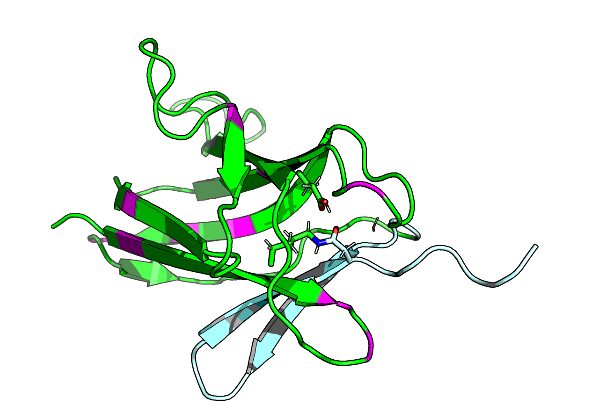

# DogCatcher

Engineering of a new orthogonal pair of catcher–tag. This repo features code to create variants of isopeptide bonded protein.

* Parts of this code was used to do design predictions that went into [Keeble et al 2022](https://www.sciencedirect.com/science/article/pii/S2451945621003159).
* No working data is present in this repo
* The core of this work was done in 2018. This repo is not maintained. Subsequent 'afterhours' work can be found in [isopeptide-builder repo](https://github.com/matteoferla/isopeptide-builder). For discussion on isopeptide bonds see [blog post](https://blog.matteoferla.com/2018/09/everything-you-wanted-to-know-about.html).

# Models

[Interactive page](https://michelanglo.sgc.ox.ac.uk/data/1980b506-c393-4c9e-9f90-a77a89a4b5fd).

the class ``model_maker.Catcher`` was used to create catcher variants with the script ``make_dogC.py`` using PyRosetta.
This has been written to be flexible and generally applicable to isopeptide bonds —see below.

Internal note: the variants generated with this class differ slightly from those in unpublished analyses predicting mutants
involved in the engineering of DogC. The reason for this is that a multitude of models were made with differing settings.
Especially for the A75P variant ——herein the protocol for that loop is
20 cycles of cartesian FastRelax on the loop (73–80) with 0.1 weighted `omega` and 0.1 weighted `fa_rep`, followed by 20 cycles of internal coordinate FastRelax on the loop (73–80).
Previously remodel of the loop with `generic_aa` set to glycine to allow  the sampling of cis-proline, along with forcing the ABEGO type to cis (O) for either of the proline pair,
did not result in a better scoring model.

The tetrahedral transition state is not chiral for an aspartate–lysine sidechain conjugation (a hemiacetal), but it is for
an asparagine–lysine sidechain conjugation (hemiamidal). Here only one chirality is sampled and is based upon visual inspection of the model.

# Catcher module

Class initialisation just sets the parameters.

    dogC = Catcher(lyx=9, asx=121, glh=70, asx_type='ASN', cut_resi=105, other_res=['WAT'],
                   params_folder='params',
                   iso_constraint_file='constraints/iso.dogC.cst',
                   trans_constraint_file='constraints/ASA-LYX.dogC.cst')

A pose can be loaded via 

    pose = dogC.load_pose_from_file('data/RrgA.altered.pdb')
    
which can be relaxed with a CCP4 map:

    dogC.relax_with_ED(pose, 'data/2ww8.ccp4')
    
or its isopeptide only:

    dogC.relax_isopeptide(pose)
    
or around a residue:

    dogC.relax_around_mover(pose, 123, 'A', cycles=5, distance=5, cartesian=False)
    
Then variants can be made (return a new pose):

    mutant = dogC.make_mutant('A123D')
    catcher = dogC.make_catcher_only(pose)
    tag = dogC.make_tag_only(pose)
    unreacted = dogC.make_unreacted(pose)
    trans = dogC.make_transition(pose)
    
Alternatively, get all the scores:

    s = dogC.get_score_panel(pose, save_variants=True, filename='xxxxx')
